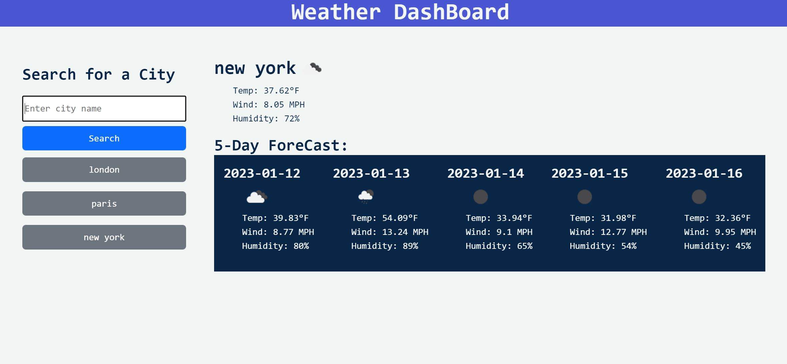

### 06-Weather-Dashboard

## Description 

    This simple Weather Dashboard allows user to view weather and forecasts of searched city.
    It is using the Openweather API to do so.
    
    It dynamically updated the HTML to show searched history, and 
    could be use to search for that city's weather again. 

Github Repo: https://github.com/byxzESC/06-Weather-Dashboard

Deployed Page: https://byxzesc.github.io/06-Weather-Dashboard/

> Example of usage

## Table of Contents 

* [Installation](#installation)
* [Usage](#usage)
* [Credits](#credits)
* [License](#license)

## Installation
    N/A

## Usage 

Step 1. Type in what city to search for

Step 2. click the blue save button on the left side

Step 3. It will display the current weather and also 5 days of forecast for the city being searched.

## Credits

N/A

## License

N/A

## Badges

## Features

[OpenWeather.org](https://openweathermap.org/)

## Tests

N/A

No written test yet.
